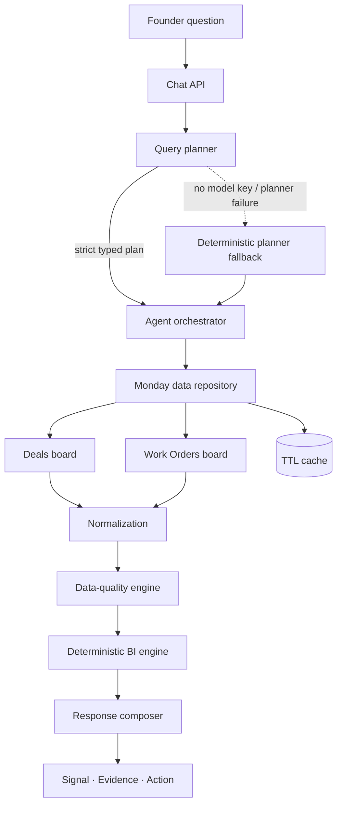

# Skylark Signal

> Ask the business. See the signal.

Skylark Signal is a Founder Intelligence agent over monday.com. It answers business questions from the Deals and Work Orders boards, calculates metrics in deterministic TypeScript, surfaces data-quality limitations, and makes every result traceable through **Signal → Evidence → Action**.

## Links

- Hosted prototype: <https://skylark-signal-one.vercel.app>
- Source repository: _added after repository publication_
- Assignment submission form: <https://forms.gle/qGihfi4zCLBxKWK68>

The public prototype falls back to a clearly labelled **Demo Mode — simulated environment** when server-side Monday credentials are not configured. Demo Mode exercises the full agent pipeline with deterministic synthetic records; it never presents simulated data as live Monday data.

## Problem

Founder questions cross commercial and operational systems, while the source data contains missing identifiers, sparse dates and amounts, embedded headers, duplicate-like records, inconsistent labels, and no trustworthy row-level key between boards. A conventional chatbot can sound confident while using the wrong scope or arithmetic.

## Solution

Skylark Signal separates language understanding from business computation:

1. A constrained planner identifies intent, boards, filters, period, and metrics.
2. A read-only Monday adapter retrieves every item from both configured boards.
3. A normalization layer preserves raw values and creates canonical typed records.
4. A data-quality engine flags exclusions and confidence-limiting issues.
5. Deterministic analytics code performs every sum, filter, ranking, and risk rule.
6. A response composer returns Signal, Evidence, Risk, Action, caveats, sources, records, and calculation lineage.

This reduces hallucinated arithmetic and makes results testable.

## Requirement traceability

| Assignment requirement | Implementation |
|---|---|
| Conversational interface | Founder/Analyst workspace, suggested questions, follow-up context, targeted clarification |
| monday.com integration | Server-side GraphQL adapter; read-only queries; pinned API version; cursor pagination across both board IDs |
| Missing/null values | Typed nullable fields; never imputed; caveats and exclusions shown |
| Inconsistent dates, names, text | Multi-format date parser, whitespace/case normalization, status canonicalization; raw source preserved |
| Meaningful incomplete-data answers | Metrics use only valid inputs and state excluded/missing counts |
| Founder-level BI | Pipeline, billed revenue, sector ranking, deal attention, work-order risk, cross-board comparison |
| Context and insights | Signal → Evidence → Risk → Action structure |
| Cross-board queries | Aggregate join on normalized sector; unsafe masked-name/customer joins rejected |
| Graceful API failure | Timeout, auth, permission, rate-limit, schema, stale-cache, empty-board, and missing-config paths |
| Leadership updates (optional) | Live/simulated weekly briefing with pipeline, billed revenue, sales/operations risks, quality, and actions |
| Hosted, source, README | Public deployment above; repository link added after publication |
| Decision Log ≤2 pages | `DECISION_LOG.md` plus submission-ready PDF |

More detail is in [`docs/REQUIREMENTS_TRACEABILITY.md`](docs/REQUIREMENTS_TRACEABILITY.md).

## Architecture



### Module boundaries

- `lib/monday`: GraphQL requests, pagination, safe errors.
- `lib/data`: repository/cache, normalization, issue detection, quality scoring.
- `lib/agent`: model/deterministic query planners and orchestration.
- `lib/analytics`: metrics, rules, lineage, confidence, leadership update.
- `components`: executive UI, answer evidence, pulse, signal map, and states.
- `app/api`: validated server-only endpoints.

## Agent workflow

The planner produces a strict internal contract:

```json
{
  "intent": "pipeline_health",
  "boards": ["deals"],
  "sector": "renewables",
  "comparisonSector": null,
  "period": "current_quarter",
  "metrics": ["pipeline_value", "stage_distribution", "late_stage_value"],
  "needsClarification": false,
  "confidence": 0.9
}
```

Raw chain-of-thought is never exposed. The UI shows only a concise scope statement. If `OPENAI_API_KEY` exists, the planner uses strict JSON-schema output through the OpenAI Responses API and `gpt-5.4-mini`; otherwise it uses the same deterministic contract and discloses that fallback. OpenAI documents both [strict function/structured output schemas](https://developers.openai.com/api/reference/typescript/resources/beta/subresources/responses/methods/create) and [structured-output support for GPT-5.4 Mini](https://developers.openai.com/api/docs/models/gpt-5.4-mini).

## monday.com integration

- POSTs GraphQL only to `https://api.monday.com/v2`.
- Keeps the token and board IDs server-side.
- Pins `API-Version: 2026-07`, the current stable version when implemented; monday recommends passing an explicit version to avoid silent breaking changes ([monday API versioning](https://developer.monday.com/api-reference/docs/api-versioning)).
- Reads both configured boards concurrently.
- Uses `items_page(limit: 500)` followed by `next_items_page` until the cursor is empty ([pagination reference](https://developer.monday.com/api-reference/reference/items-page)).
- Reads `text`, raw `value`, column ID/type, and column title; monday documents the text/raw distinction for [column values](https://developer.monday.com/api-reference/reference/column-values-v2).
- Performs no mutation and exposes no arbitrary GraphQL surface to the browser.
- Caches snapshots for 120 seconds by default and labels responses LIVE, CACHED, STALE, or SIMULATED.

## Data normalization

- **Raw preservation:** every normalized record retains its raw Monday item and original column values.
- **Text:** trims, collapses whitespace, matches case-insensitively, keeps display form.
- **Dates:** accepts ISO, `DD/MM/YYYY`, `DD-MM-YYYY`, native dates, and Excel serials; validates components; flags ambiguous day/month dates.
- **Numbers:** handles INR/currency symbols, Indian/international commas, whitespace, parentheses negatives, null markers, non-finite values.
- **Statuses:** maps only known equivalents; unknown labels become quality warnings rather than guessed categories.
- **Duplicate/header handling:** embedded sheet headers and duplicate-like deal fingerprints are excluded with lineage.
- **Schema resilience:** columns are found by normalized title aliases rather than array position.

## Data quality

The score represents analysis reliability, not mathematical certainty in generated prose. It combines severity-weighted issue rate with the record exclusion rate and remains bounded between 35 and 100. Checks include:

- missing identifiers/required analytical fields;
- invalid or ambiguous dates;
- unparseable/negative amounts;
- unknown statuses;
- duplicate-like records and embedded headers;
- end-before-start dates;
- billed value greater than stated pre-GST order value.

Every answer can show relevant caveats and supporting source records.

## Analytics engine

| Metric | Deterministic definition |
|---|---|
| Active pipeline | Sum of valid deal values where normalized status is `open` or `on_hold` |
| Quarterly pipeline | Active pipeline with a valid tentative close date inside the current UTC quarter |
| Late-stage value | Active value in proposal/commercial, negotiation, project-won, or work-order stages |
| Billed revenue | Sum of Work Orders “Billed Value … Excl. GST”; explicitly not accounting-recognized revenue |
| Deal attention | On hold, tentative close date passed/missing, deal value missing, or >180 days in early stage |
| At-risk work order | Paused/stuck, client details pending, start passed/not started, or end passed/still active |
| Execution health | `1 − at-risk active work orders / active work orders` |
| Pipeline strength | Sector pipeline indexed to the largest sector |

No probability weights, activity fields, joins, or revenue-recognition rules are invented when the source lacks them.

## Cross-board intelligence

The supplied files share six clean sector values but no trustworthy row-level key. Customer codes use different namespaces, and 36 shared masked deal names are non-unique. Therefore cross-board analysis aggregates each board by normalized sector and then compares pipeline strength with execution health. This is safer and documented in every cross-board lineage view.

## Leadership updates

“Leadership updates” is interpreted as a generated weekly decision brief, not an export button. It combines active pipeline, billed revenue, commercial exceptions, operational exceptions, strongest sector, quality score, and next actions from the same live snapshot. The result can be copied and expanded to records/calculations.

## Tech stack

- Next.js 16 App Router, React 19, strict TypeScript
- Server-side Monday GraphQL and OpenAI Responses API via `fetch`
- Zod request/environment validation
- Hand-built responsive CSS/SVG visuals (no dashboard template)
- Vitest, TypeScript, ESLint
- Vercel deployment

The stack keeps frontend, API, and deployment in one repository while preserving clear domain modules.

## Environment variables

Copy `.env.example` to `.env.local`:

```bash
MONDAY_API_TOKEN=your_server_only_token
MONDAY_DEALS_BOARD_ID=1234567890
MONDAY_WORK_ORDERS_BOARD_ID=9876543210
MONDAY_API_VERSION=2026-07

# Optional model planner
OPENAI_API_KEY=your_server_only_key
OPENAI_MODEL=gpt-5.4-mini

DATA_MODE=auto
CACHE_TTL_SECONDS=120
```

Never prefix secrets with `NEXT_PUBLIC_`.

## Monday setup

1. Download the two spreadsheets linked in the assignment.
2. Inspect sheet names before importing: the downloaded filenames are swapped relative to their contents (`deal-funnel.xlsx` contains **work order tracker**; `work-order-tracker.xlsx` contains **Deal tracker**).
3. Create separate **Deals** and **Work Orders** boards.
4. Import each sheet, keeping the first column as item name and using date, number, status/dropdown, and text columns as appropriate.
5. Remove or leave source anomalies intentionally; the app detects them. Do not manually “clean” the evaluator data without documenting it.
6. Copy each board ID from monday Developer Mode.
7. Create a token belonging to a user who can read both boards and configure it only on the server/deployment. Monday tokens inherit the user’s permissions ([authentication reference](https://developer.monday.com/api-reference/docs/authentication)).
8. Set `DATA_MODE=live` to fail fast when any live variable is missing; use `auto` for evaluator-friendly labelled Demo Mode fallback.

## Local setup

```bash
npm install
cp .env.example .env.local
npm run dev
```

Open <http://localhost:3000>. Verify `/api/health` without expecting secrets to be returned.

## Deployment

1. Import the repository into Vercel.
2. Add the five server-side variables required for Live + model-planned mode.
3. Deploy and open `/api/health`.
4. Run the twelve cases in `docs/TEST_MATRIX.md` against the public URL.
5. Verify the header says **Live from Monday.com** before presenting live data. If it says Demo Mode, the experience is simulated and clearly disclosed.

## Example queries

- “How is our pipeline looking this quarter?”
- “How is Mining performing?”
- “Which sector has the strongest pipeline?”
- “Which deals need attention?”
- “Which work orders are at risk?”
- “Compare Renewables sales pipeline with execution.”
- “Prepare my leadership update.”
- “What is our billed revenue?”

“How is Energy performing?” intentionally asks a clarification because Energy is absent from the supplied sector taxonomy; the agent offers source sectors instead of inventing a mapping.

## Design decisions and trade-offs

- **API over MCP:** direct API makes read-only scope, cursor pagination, caching, errors, and deployment explicit and testable within the time box.
- **LLM plans, code calculates:** better trust and unit-testability than model arithmetic.
- **Sector-level cross-board join:** lower granularity, but avoids false row matches.
- **No database:** Monday remains source of truth; a short in-memory cache is sufficient for the prototype.
- **No streaming protocol:** the UI displays bounded real pipeline phases while a single validated request runs, reducing complexity.
- **No arbitrary report builder:** the evaluator path is focused on meaningful end-to-end workflows.

## Known limitations

- Live Monday behavior requires valid board access and was not exercised without account credentials.
- Column-title aliases cover the supplied schema and common variants; a production system would add an admin mapping screen.
- Billed revenue is not formal revenue recognition.
- The source lacks recent activity/next-step fields, so deal staleness uses date/stage-age rules.
- In-memory cache is per server instance; production scale would use Redis or another shared cache.
- Conversation context is sent by the client and validated, not persisted across browsers.
- Demo data is synthetic and intentionally not a hidden copy of the supplied spreadsheets.

## Security

- secrets are server-only and never returned by health/settings endpoints;
- browser input is length-validated and cannot submit GraphQL;
- Monday requests are read-only query documents defined in source;
- logs contain event names, timing, counts, and intent—not tokens or record payloads;
- model responses are schema-constrained and never perform calculations directly.

## Testing

```bash
npm run typecheck
npm run lint
npm test
npm run build
```

Automated coverage includes date/number normalization, raw preservation, quality scoring, all core analytics intents, cross-board lineage, absent-sector clarification, ambiguous questions, and contextual follow-ups. Manual/API/failure cases are in [`docs/TEST_MATRIX.md`](docs/TEST_MATRIX.md).

Final local gates: **20/20 tests passed**, strict TypeScript passed, ESLint passed, the optimized Next.js production build passed, and `npm audit --omit=dev` reported zero production vulnerabilities. The public deployment returned HTTP 200, its health/bootstrap endpoints disclosed Demo Mode correctly, and an end-to-end strongest-sector chat request returned a traced result.

## AI tools used

- **OpenAI Codex:** architecture brainstorming, implementation assistance, debugging, tests, design iteration, and documentation.
- **OpenAI official documentation:** Responses API structured outputs and model capability verification.
- **monday.com official documentation:** current API version, authentication, pagination, and column-value behavior.

All AI-assisted code was reviewed, type-checked, linted, tested, built, and adapted to the assignment’s real data and constraints. AI-generated work is not presented as entirely manual.

## Future improvements

1. Live-schema mapping UI with saved per-board column contracts.
2. Redis cache, background refresh, and data-freshness SLOs.
3. More robust record linkage after a real shared deal/work-order key is added.
4. Planner/answer evaluation set with intent, filter, metric, and faithfulness scores.
5. OAuth installation, tenant isolation, and role-aware access.
6. Activity timeline support when the board adds last-contact/next-step fields.
7. Exportable leadership briefs after the core live workflow is validated.
